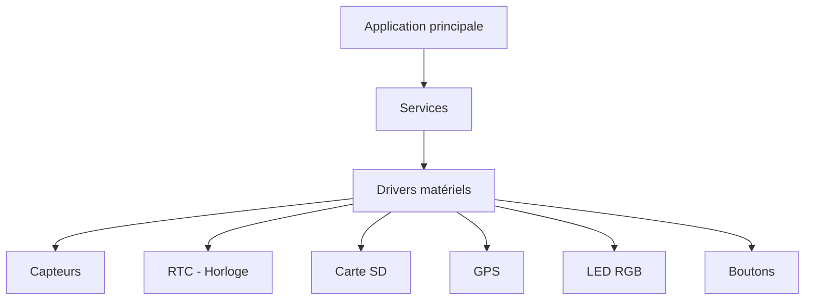
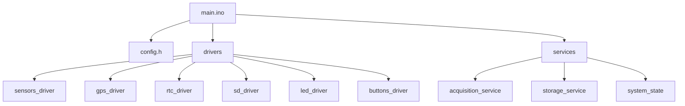
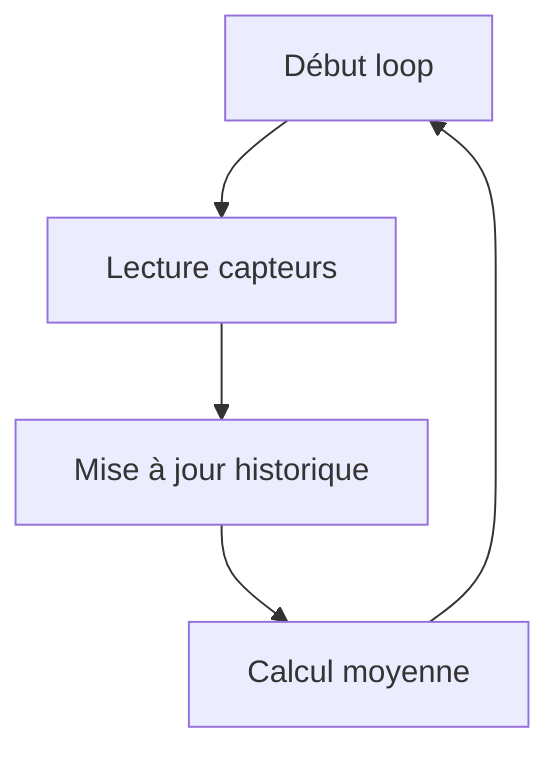
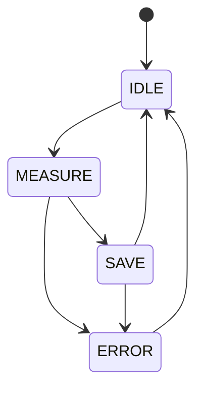
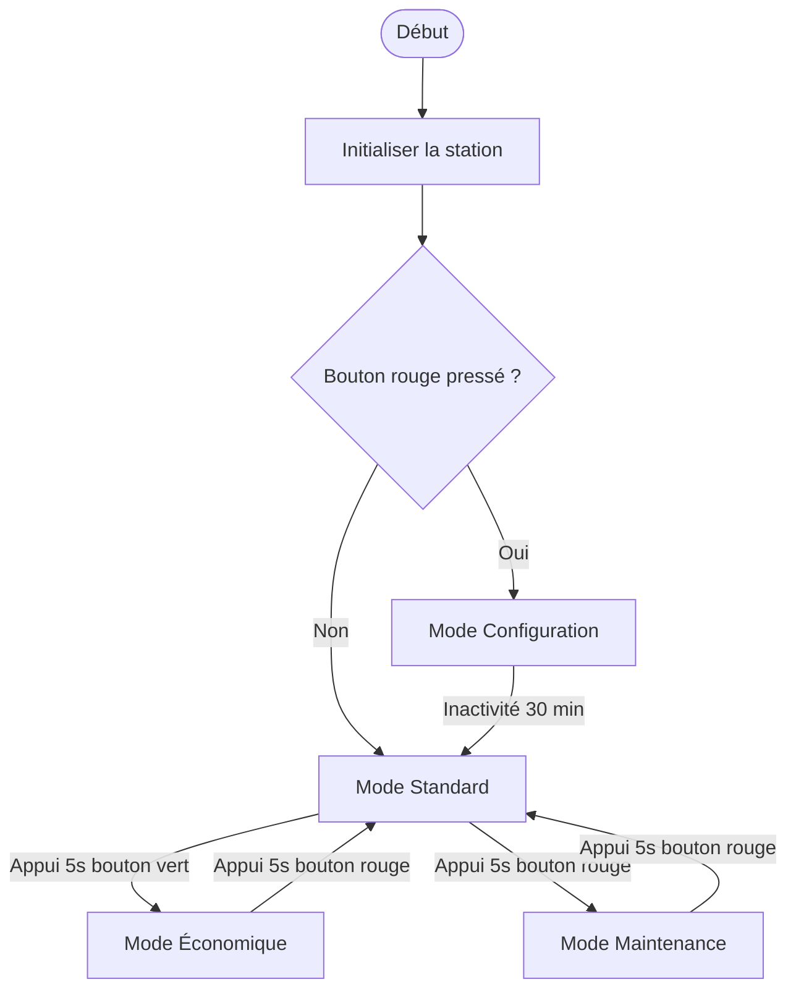

# Livrable 3 - Maquette
> Mariza Latrasse, Alban Combes , Yann Falco, Emma Lepert

---

## Table des matières

- Introduction
- Contexte
- Problématique
- Objectif du livrable
- Matériel utilisé

### I- Architecture du système
- Architecture logicielle
- Organisation du code

### II- Fonctionnement du logiciel
- Fonctions principales
- Cycle de fonctionnement
- Machine à états

### III- Complilation

- Évolutions futures

### Conclusion

<br>

---


## Introduction

Le projet consiste à travailler sur un prototype de station météo embarquée destinée à équiper des navires. Ceux-ci pourront à long terme échanger des données pour prévoir des catastrophes naturelles. La station météo utilisera des capteurs pour récupérer différentes valeurs. Ces valeurs mesurées seront exploitées à la fois pour des informations instantanées mais aussi pour sauvegarder ces données sur une carte SD.

<br>

## Contexte

L'Agence Internationale pour la Vigilance Météorologique (AIVM) se lance dans un projet ambitieux : déployer dans les océans des navires de surveillance équipés de stations météo embarquées chargées de mesurer les paramètres influant sur la formation de cyclones ou autres catastrophes naturelles.
Un grand nombre de sociétés utilisant des transports navals ont accepté d'équiper leurs bateaux avec ces stations embarquées. En revanche, ces dernières devront être simples et efficaces et pilotables par un des membres de l'équipage (une documentation technique utilisateur sera mise à disposition).
L'un des dirigeants de l'agence a proposé une startup dans laquelle travaille son fils ingénieur pour la création du prototype.

<br>

## Problématique

Comment développer un système de mesure météorologique embarqué robuste et
automatisé, adapté aux contraintes du milieu marin, tout en garantissant la qualité et la
continuité des données collectées ?

<br>

## Objectif du livrable

Présenter l’architecture du programme, expliquer :

- les constantes et tableaux
- les fonctions principales
- la machine à états
- l’organisation générale du code

> Ce livrable ne contient pas de code finalisé, seulement la structure et le fonctionnement.

<br>

## Matériel utilisé

### Microcontrôleur

- Arduino Uno (ATmega328P)

### Périphériques

- Lecteur carte SD (SPI)
- Horloge RTC (I2C)
- LED RGB (2 fils)
- 2 boutons poussoirs

### Capteurs principaux

- Pression atmosphérique (I2C/SPI)
- Température de l’air (I2C/SPI)
- Hygrométrie (I2C/SPI)
- GPS (UART)
- Luminosité (analogique)

### Modules complémentaires prévus

- Température de l’eau (analogique)
- Force du courant marin (I2C)
- Force du vent (I2C)
- Taux de particules fines (2 fils)

---

## I- Architecture du système
<br>
## Architecture logicielle

Le programme est structuré en trois couches :

1. **Drivers matériels** : communication directe avec les capteurs et périphériques  
2. **Services** : traitement et logique métier  
3. **Application principale** : orchestration dans `main.ino`  

### Diagramme global de l’architecture



## II- Fonctionnement du logiciel
<br>
## Organisation du code

```
main.ino               // Initialise le système et contient loop()
config.h               // Contient constantes, identifiants capteurs, paramètres globaux

drivers/               // Modules d’accès matériel
  sensors_driver       // Lit tous les capteurs I2C, SPI, analogique
  gps_driver           // Lit et valide les données GPS
  rtc_driver           // Fournit date et heure
  sd_driver            // Sauvegarde données sur carte SD
  led_driver           // Contrôle LED RGB
  buttons_driver       // Gère les boutons poussoirs

services/              // Modules de traitement
  acquisition_service  // Coordonne lecture capteurs et vérification erreurs
  storage_service      // Sauvegarde périodique sur SD
  system_state         // Gestion machine à états
```

### Schéma Mermaid de l’organisation



> Cette structure permet la modularité, la maintenance et l’extension future (ajout de capteurs ou services).

---

## Fonctions principales

### Constantes et tableaux

```c
#define Nb_Capteurs 3             // Nombre total de capteurs
#define indice_max_Tableau 4      // Nombre de mesures pour moyenne glissante

float Tab_Mesures[Nb_Capteurs];   // Dernière mesure
int Tab_Erreur[Nb_Capteurs];      // 0 = OK, 1 = Erreur
float Tab_Moy_Instant[Nb_Capteurs]; // Moyenne instantanée

float Tab_Capteur_i[indice_max_Tableau + 1]; // Historique par capteur
```

---

### Lecture des capteurs

```c
void Lecture_Capteurs()
{
    Tab_Erreur = 0;  // Réinitialise les erreurs

    for (int i=0; i<Nb_Capteurs; i++)
    {
        float mesure;
        int erreur = Lecture_capteur(&mesure, i); // Lecture simulée
        if (erreur==0)
            Tab_Mesures[i] = mesure;   // Stocke mesure valide
        else
            Tab_Erreur[i] = 1;        // Signale erreur
    }
}
```

---

### Mise à jour des mesures

```c
void Maj_Mesures(float Tableau[], int Erreur[])
{
    for (int i=0; i<Nb_Capteurs; i++)
    {
        if (Erreur[i]!=1)
            Tab_Capteur_i = Decalage(Tab_Capteur_i, Tableau[i]);
    }
}
```

---

### Décalage et calcul moyenne

```c
float* Decalage(float Tableau[], float Valeur)
{
    for (int i=0; i<indice_max_Tableau; i++)
        Tableau[i] = Tableau[i+1]; // Décalage gauche
    Tableau[indice_max_Tableau] = Valeur; // Nouvelle valeur
    return Tableau;
}

float Calcul_Moy_Instant(float Tableau[])
{
    float somme = 0;
    for (int i=0; i<=indice_max_Tableau; i++)
        somme += Tableau[i];
    return somme/(indice_max_Tableau+1); // Moyenne glissante
}
```

### Diagramme du cycle principal



---

## Machine à états



États :

- IDLE : attente  
- MEASURE : acquisition données  
- SAVE : sauvegarde sur SD  
- ERROR : gestion des erreurs

---

# Modes de fonctionnement

 



### Mode Standard

Acquisition normale + sauvegarde SD

 

### Mode Économique

Réduction fréquence + désactivation capteurs secondaires

 

### Mode Maintenance

Consultation en direct + retrait sécurisé SD

 

### Mode Configuration

Modification paramètres (acquisition désactivée)


---


# Gestion des erreurs


| Erreur | Indication LED |
|--------|----------------|
| GPS inaccessible | Rouge + Jaune clignotant |
| Capteur défaillant | Rouge + Vert clignotant |
| Carte SD pleine | Rouge + Blanc |
| Erreur écriture SD | Rouge + Blanc (blanc long) |


---

## Évolutions futures

- Ajout capteurs marins  
- Communication inter-navires  
- Optimisation énergétique  
- Implémentation RTOS  
- Transmission radio


---

## Conclusion

Cette architecture garantit :

- Modularité  
- Robustesse  
- Évolutivité  
- Lisibilité du code  

Elle constitue une base solide pour le développement complet de la station météo embarquée.
